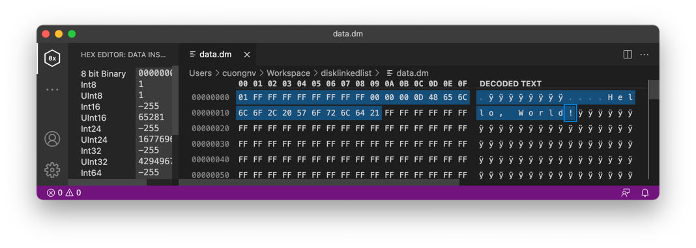

# DiskLinkedList

Keep data as a linked list on disk. An alternative way to reduce redundant operation for `DiskLruCache`

## Use-case

Android have build-in [DiskLruCache.java][1], but it has too many redundant operations on runtime,
`DiskLinkedList` using [memory-mapped file mechanism][2] to keep data on disk as a linked list.

## Advantage

- Compatible with all systems running Java (Android, JVM, Kotlin/JVM).
- Get existed / remove (move / free): O(1).
- New put / get (allocation): O(n) on worst fragment or O(1) on defragmented.
- High performance.
- Inconsiderable I/O execution.
- Easy to use.

## File data structure

```text
1 byte (B) to make use or not | 4B prev | 4B next | 4B length | extra byte array
```

Each entry, `DiskLinkedList` storage as a node and keep as structure above.

## Usage

### Create new disk linked list data

```kotlin
val diskLinkedList = DiskLinkedList.open(
    file = File("data.dm"),       // file on disk.
    initialByteSize = 20 * 1024L, // initial size of file.
    scaleFactor = 0.75f           // file size scale factor on data larger than current size.
)

// Create new record.
diskLinkedList.addFirst("Hello, World!".toData())
diskLinkedList.log()              // 0=Hello, World!
```

#### Data on disk



---

### More and more

```kotlin
// Add "Second Node" to first.
diskLinkedList.addFirst("Second Node".toData())
diskLinkedList.log()
// Output: 26=Second Node > 0=Hello, World!

// Keep "Second Node" to move later.
val second = diskLinkedList.first!!

// Add 3 nodes to first.
repeat(3) { index ->
    diskLinkedList.addFirst("Hello $index".toData())
}
diskLinkedList.log()
// Output: 90=Hello 2 > 70=Hello 1 > 50=Hello 0 > 26=Second Node > 0=Hello, World!

// Move "Second Node" to first.
diskLinkedList.moveToFirst(second)
diskLinkedList.log()
// Output: 26=Second Node > 90=Hello 2 > 70=Hello 1 > 50=Hello 0 > 0=Hello, World!
```

---

### Sync and de-fragment

- `DiskLinkedList` <span style="color: red; font-weight: bold;">NOT</span> auto-sync to file, it only sync to file
  after `synchronize` executed.
- Beside of that, to avoid fragment on file, `DiskLinkedList` support `defragment` function to do.

```kotlin
// Remove last.
diskLinkedList.removeLast()
diskLinkedList.log()
// Output: 26=Second Node > 90=Hello 2 > 70=Hello 1 > 50=Hello 0

// Then continue to add 2 nodes at first.
repeat(2) { index ->
    diskLinkedList.addFirst("Bye $index".toData())
}
diskLinkedList.log()
// Output: 110=Bye 1 > 0=Bye 0 > 26=Second Node > 90=Hello 2 > 70=Hello 1 > 50=Hello 0
// New node "Bye 1" will add at pointer 110 instead of 0 -> FRAGMENTED!!!

// Defragment data.
diskLinkedList.defragment()
diskLinkedList.log()
// Output: 0=Bye 1 > 18=Bye 0 > 36=Second Node > 60=Hello 2 > 80=Hello 1 > 100=Hello 0

// Sync every change to disk.
diskLinkedList.synchronize()
```

## Dependency

### Maven

```xml

<dependency>
    <groupId>org.cuongnv.disklinkedlist</groupId>
    <artifactId>disklinkedlist</artifactId>
    <version>0.5.0</version>
</dependency>
```

### Gradle Kotlin DSL

```kotlin
implementation("org.cuongnv.disklinkedlist:disklinkedlist:0.5.0")
```

### Gradle Groovy

```groovy
implementation 'org.cuongnv.disklinkedlist:disklinkedlist:0.5.0'
```

## License

```
Copyright 2021 Cuong V. Nguyen (github.com/cuongnv126).

Licensed under the Apache License, Version 2.0 (the "License");
you may not use this file except in compliance with the License.
You may obtain a copy of the License at

   http://www.apache.org/licenses/LICENSE-2.0

Unless required by applicable law or agreed to in writing, software
distributed under the License is distributed on an "AS IS" BASIS,
WITHOUT WARRANTIES OR CONDITIONS OF ANY KIND, either express or implied.
See the License for the specific language governing permissions and
limitations under the License.
```

[1]: https://android.googlesource.com/platform/libcore/+/jb-mr2-release/luni/src/main/java/libcore/io/DiskLruCache.java

[2]: https://en.wikipedia.org/wiki/Memory-mapped_file